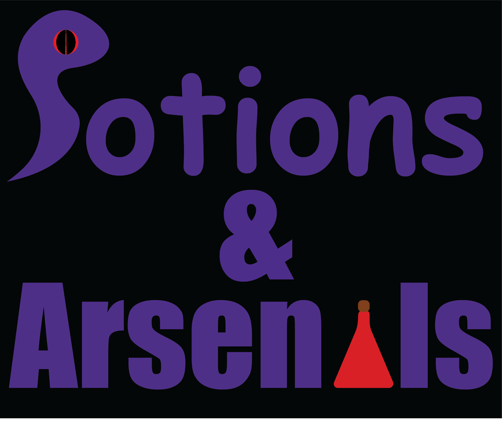
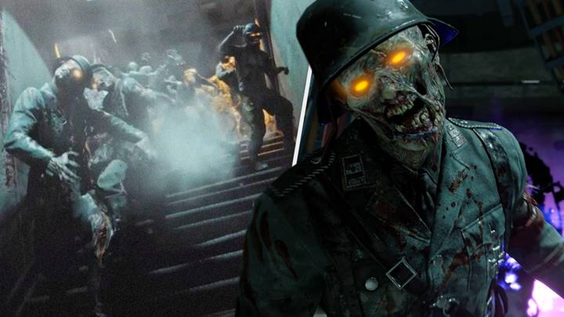

# Game Design Document 📑

## Title: Potions & Arsenals

# Table of Contents

1. [Introduction](#introduction)
   1. [Game Summary](#game-summary)
   2. [Inspiration](#inspiration)
   3. [Player Experience](#player-experience)
   4. [Platform](#platform)
   5. [Developer Software](#development-software)
   6. [Genre](#genre)
   7. [Target Audience](#target-audience)
2. [Concept](#concept)
   1. [Gameplay overview](#gameplay-overview)
   2. [Theme Interpretation (Sacrifice Is Strength)](#theme-interpretation-sacrifice-is-strength)
   3. [Primary Mechanics](#primary-mechanics)
   4. [Secondary Mechanics](#secondary-mechanics)
3. [Art](#art)
   1. [Theme Interpretation](#theme-interpretation)
   2. [Design](#design)
4. [Audio](#audio)
   1. [Music](#music)
   2. [Sound Effects](#sound-effects)
5. [Game Experience](#game-experience)
   1. [UI](#ui)
   2. [Controls](#controls)
6. [Timeline](#timeline)

# Introduction

## Game Summary

In Potions & Arsenals, you are a mad scientist working on a new type of blackout blinds for chronically online people when something goes wrong. You open a rift into the shadow realm and now shadow demons are trying to “perma-ban” you from existence. But good news! You are also one of the biggest weapons manufacturers in the state of Florida. Your goal is to use alchemy to upgrade your weapons and take out hordes of shadow demons. Turn back on all the factories to send the shadows back to where they came from.

## Inspiration

### COD Zombies

Call Of Duty Zombies was a big inspiration for the gun play, and the constant wave of enemies chasing the player. It also inspired us to make the game in first person. The alchemy table is loosely based on the pack-a-punch system in COD. 

### Risk of Rain 2

Risk of Rain 2 the main inspiration for the player upgrading system and the rogue-like gameplay style. We also took inspiration from the art-style. We want to follow the low-poly style and the look of the particles.

## Player Experience

In this rogue-like game, the user will need to shoot and eliminate a constant influx of enemies that constantly get harder and harder. The user will have to troubleshoot different recipes to get potions to upgrade their weapons. The player will need to use luck and strategy to craft the perfect weapon build and to defeat the shadows.

## Platform

The game is developed to be release on Windows and Linux as Standalone releases

## Development Software

Godot Engine 4
Blender 3.5 for graphics and UI
Garageband for music

## Genre

Singleplayer, FPS, rogue-like

## Target Audience

This game is for casual gamers because one can start a game and mindlessly shoot shadows for an hour without taking it too seriously and stop when the game gets too hard. The game is also for hardcore gamers that want to take the upgrading system to the limit and see how far they can get without dying.

# Concept

## Gameplay overview

The player starts in a lab with a few shadow demons spawning in. They start with a basic assault rifle and handgun. They shoot demons that occasionally drop alchemy ingredients. The player combines ingredients to make potions and uses those potions on guns to make them more powerful. The player will upgrade their weapons to defeat harder swarms of enemies until they inevitably die.

## Theme Interpretation (Sacrifice Is Strength)

‘Shadows’ interpretation - Shadows as a dark entity in the game. Resembling a dark and mysterious force that needs to be eliminated by the good or ‘light’ side.

‘Alchemy’ interpretation - The action of using different ingredients and materials to produce something seemingly impossible or magical. To transmute into something new.

In this game shadows are used as the main enemy in the game, resembling dark (physically & metaphorically) creatures that you must eliminate. The Alchemy is used as the main way to upgrade your characters, transmuting your weapons into something more magical and powerful.

## Primary Mechanics

| Mechanic | Description |
| -------- | ----------- |
| **Shooting** | The user will use different weapons to kill the shadow demons |
| **Philosipher's Table**  | The user can use the philosipher's table to create boons. These boons can be added to guns to make them more powerful and more effective at taking down the swarms of enemies. The user will need to figure which recipes make which potions. |
| **Generators** | Killing shadow demons gives you energy points. These energy points can be used to unlock generators. Unlocking these generators will make the difficulty harder but will also get you closer to beating the game|
| **Transmutation** | Combining guns with boons to make new powerful weapons with special effects|

## Secondary Mechanics

| Mechanic | Description |
| -------- | ----------- |
| Time as difficulty | The more time that passed. The more enemies spawn in at once, the harder they hit, and the more health they have. |
| Perma-death | When the player dies, that’s it. They will have to start from scratch if they want to try again.

# Art

## Theme Interpretation

With the themes of the jam being shadow and alchemy, we decided to go with darker colors and try to go for a more mysterious look. The game will take place in a lab, so the art style will resemble this. We’re imagining the map layout to look similar to Five on BO2 Zombies while having the art style closer to ROR2.

## Design

The art experience on the team is very limited so we hope to lean into that by using low-poly designs. We will shoot for more of a cartoon look in the enemies and maybe try to leverage filters to get this look

# Audio

## Music

To add to the overall theme and vibe of the game, there will be minimalism incorporated into the music. Heavy use of reverb and effects to fill space within the few instruments. Bass and drums will generally constitute the majority of tracks with accompanying softer sounds. Mainly through synthesized sounds rather than acoustic will further suggest the retro style.

## Sound Effects

To add more flare and polish to the experience, a multitude of environmental sound effects will give weight and feedback to the player’s actions. Rather than foley, or otherwise realistic sounds, synthesized blips, bloops, and whooshes are used.

# Game Experience

## UI

On top of the rigid pixel art constituting the rest of the art, a more smooth, higher definition style will be incorporated in the UI. Utilizing many shades of white and black allowed in the art restriction, anti-aliasing is used to further emphasize the UI.

## Controls

Keyboard
	Arrow keys / WASD
Gamepad
	Dpad

# Timeline

[Project](https://github.com/users/covmoore/projects/2/views/1)